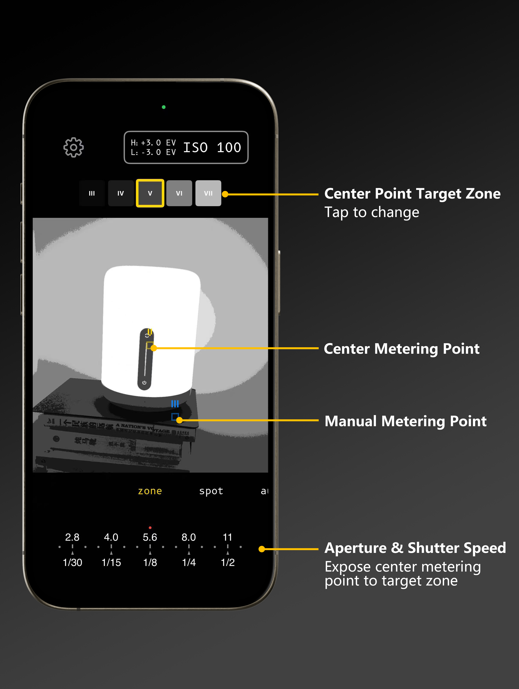
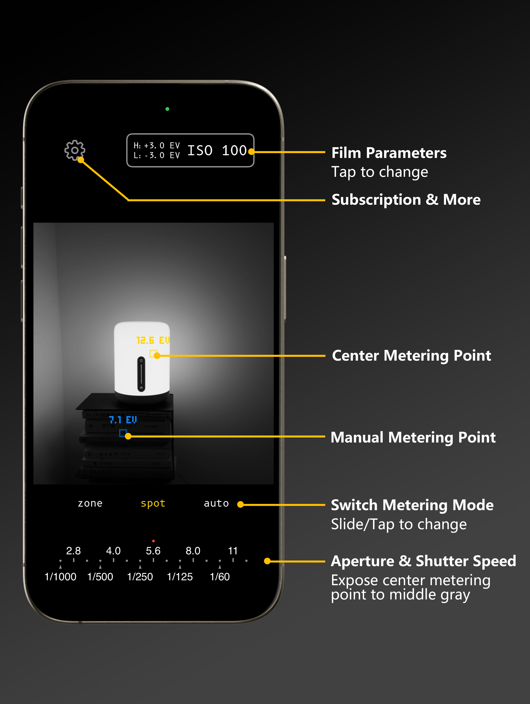
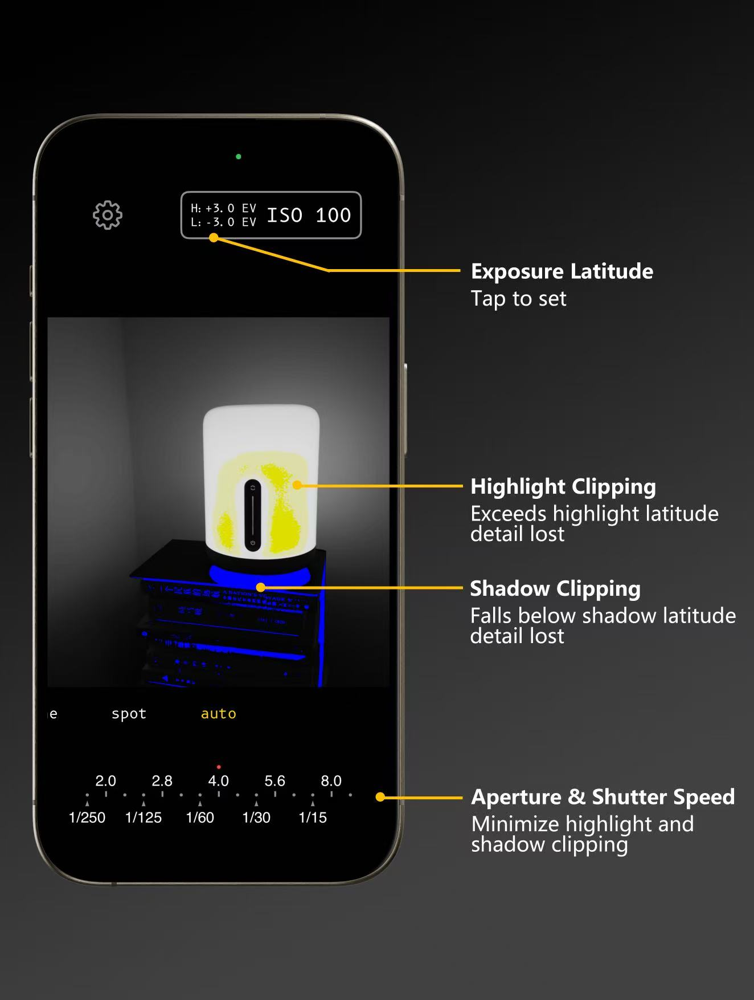

Welcome to the support page for **Modern Light Meter**, the precision tool for film photographers and exposure enthusiasts.

  
  
  

## 📌 About

**Modern Light Meter** is a spot metering app inspired by the Zone System. It visualizes dynamic range, personal tolerances, and exposure decisions — helping you shoot film with confidence.

